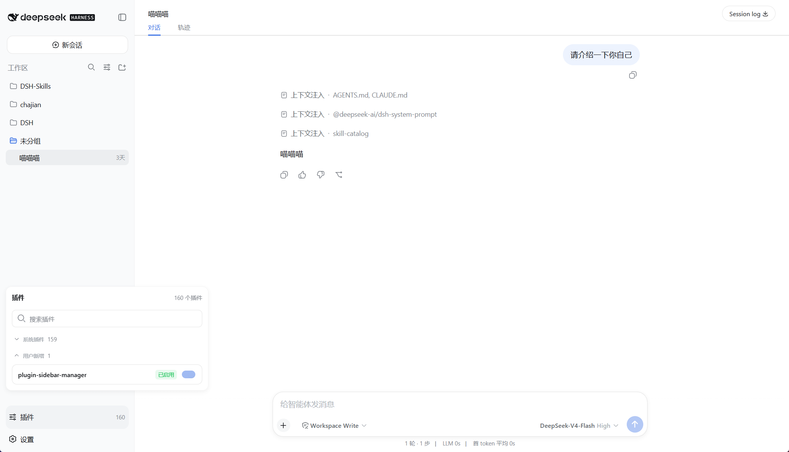

# DSH Sidebar Plugin Manager

[中文](README.md) | English

## What It Is

`dsh-plugin-sidebar-manager` adds a Plugins button to the DSH Web UI sidebar, separates built-in system plugins from user-added plugins, and makes plugin management and search easier.

## Preview

<p align="center">
  
</p>

## Features

- Shows Plugins and the total plugin count when the sidebar is expanded. The collapsed sidebar uses the same icon as Settings > Plugins.
- Opens the plugin panel above the sidebar footer.
- Classifies `@deepseek-ai/*` and `cordis:*` modules as system plugins. All other modules appear under User-added plugins.
- Follows the DSH interface language with complete Simplified Chinese and English copy.
- Searches by full module name, short name, or Loader `entryId`, without case sensitivity.
- Lets you expand or collapse the system and user-added groups independently.
- Enables or disables user-added plugins at runtime, then reloads the actual state from the Host.
- Keeps DSH and Cordis system plugins read-only. The plugin manager cannot modify itself.
- Handles loading, empty inventory, no results, retryable load failures, and per-entry operation failures.
- Closes with Escape, an outside click, or a second click on the Plugins button.

## Quick Start

You need DSH `0.1.0-rc.7` and pnpm. Run these commands in order:

```powershell
# 1. Clone the repository
git clone https://github.com/rain02333z-spec/dsh-plugin-sidebar-manager.git
cd dsh-plugin-sidebar-manager

# 2. Prepare the local package
node scripts/prepare-checkout.mjs

# 3. Install into the web profile
dsh plugin --profile web add ./packages/dsh-plugin-sidebar-manager

# 4. Restart DSH Web
dsh web
```

The Plugins entry at the bottom of the sidebar confirms that the plugin loaded.

Uninstall the plugin with:

```powershell
dsh plugin --profile web remove dsh-plugin-sidebar-manager
```

## How It Works

The plugin has two parts:

- The Host mounts the `pluginManager.setEnabled` Remote and changes the current runtime state through Cordis Loader's `Entry.update({ disabled })`.
- The Client reuses DSH's built-in, read-only `pluginInventory.list()` Remote and registers with `sidebar.footer.action`.

Runtime changes do not modify the profile's `cordis.patch.yml`. After DSH restarts, plugin states return to the values defined by the profile configuration.

## Compatibility

The current source and package target DSH `0.1.0-rc.7`. They depend on the following surfaces from that release:

- `pluginInventory` Remote
- `sidebar.footer.action` list slot
- DSH Client Module Loader
- Typert Remote generation and loading

## Development and Verification

The source follows the DSH monorepo conventions for dual Host and Client plugins. Sync this directory to `packages/extensions/plugin-manager`, add its projects to the root `tsconfig.host.json` and `tsconfig.client.json`, then run:

```powershell
Set-Location <DSH monorepo root>
pnpm exec vitest run packages/extensions/plugin-manager/tests
pnpm exec tsc -b packages/extensions/plugin-manager/tsconfig.host.json packages/extensions/plugin-manager/tsconfig.client.json
pnpm --filter dsh-plugin-sidebar-manager bundle
pnpm --filter dsh-plugin-sidebar-manager pack
```

The panel changes visible Web behavior. Before merging the plugin into DSH, also run `pnpm run test:gui` and the Web replay tests.
